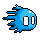
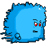
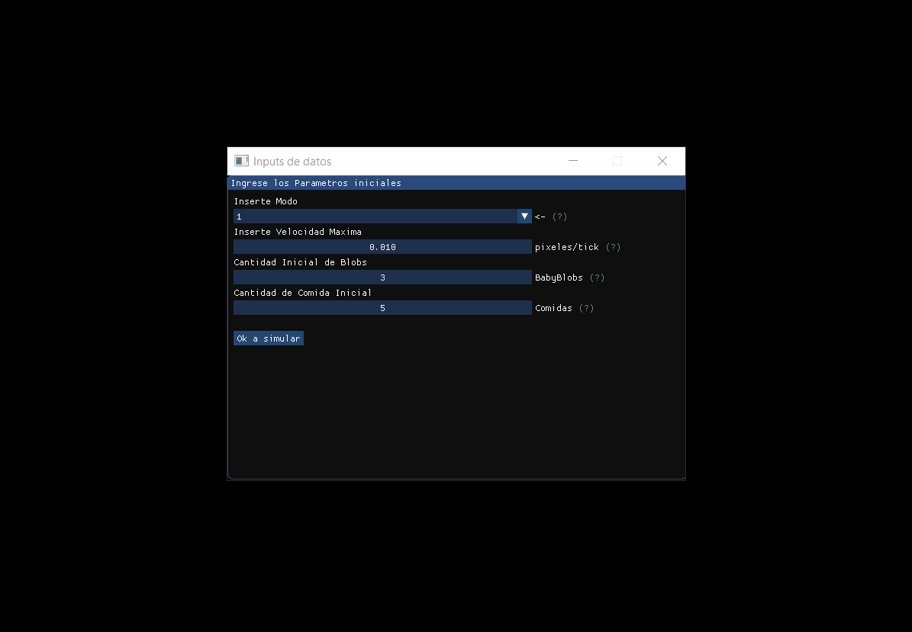

<h1 align="center">
 
    
     
    Blobs Simulation
   
</h1>

<h3 align="center">A program made with C++</a></h3>

  <a href="#what-is-it">What it is</a> •
  <a href="#how-to-run">How to run</a> •
  <a href="#preview">Preview</a> •

 

## What it is

This project follows the rules found in the purpose.pdf file provided by Algorithms and Data Structures Course 2020 (ITBA). 

The idea behind this project is to create a graphical user interface where the user can modify values and see how the simulation is working on the screen.

The simulation is made up of a toroidal map where the blobs and the food they consume are. Blobs have a radius for capturing the smell of the food, in that radius they can track the position of the food and with that information they move towards the closest food in a straight line.

There are 3 types of blobs, which can be seen in the following table.

| BabyBlob      | GrownBlob     | GoodOldBlob  |
| ------------- |:-------------:| ------------:|
| |  |  |

 

The GrownBlob is generated when 2 BabyBlob collide with each other, and the GoodOldBlob is generated when 2 GrownBlob collide with each other.

When a certain amount of food is reached by a blob, the miracle of the BlobBirth occurs, a new BabyBlob appears on the
screen in a random position and the foodCount of the parent of the blob turn to cero again. The amount of food necessary to the BlobBirth is 5, 4, 3 according to BabyBlob, GrownBlob, and GoodOldBlob.

At every tick the BlobDeath can appear, the unexpected end of a blob life, every blob has one Death
probability per tick. At the beginning of every tick, for every blob, a random number between 0 and 1 is
chosen. If the number is less than the death probability of the blob, the blob dies. Every blob in the same
age group has the same death probability.

## How to Run
the easy way to run this example is open the solution with Visual Studio IDE and tapping Local Windows Debugging button. Another way is compiling the source code by hand with the command console.

Maybe you need to install the following packages to run or modify the app:

- Allegro.5.2.6
- AllegroDeps.1.11.0

You can install them easily from NuGet packages on visual studio

## Preview

